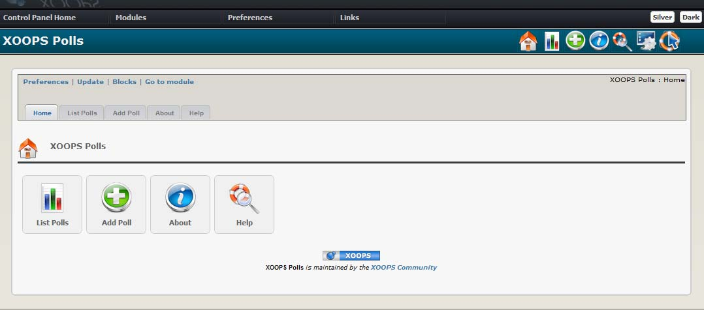

### _XOOPS Documentation Series_

# Module XoopsPoll
#### for XOOPS 2.5.7
  

## User Manual
  
  
© 2014 The XOOPS Project (www.xoops.org)    
  

## Module Purpose 

The Polls module can be used to display interactive survey forms on your site. Each poll can display a question on which visitors can ‘vote’. This can be a valuable way to collect feedback from your community. Polls can be configured to allow single or multiple choices and visitors can view the ‘results’ to date.

 

Figure 1 Main view of the XOOPS Polls Module (Admin side)

 
  
*Figure 1: Main view of the Marquee Module (Admin side)*