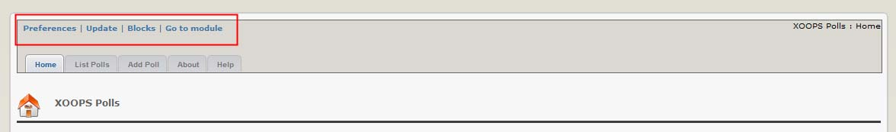
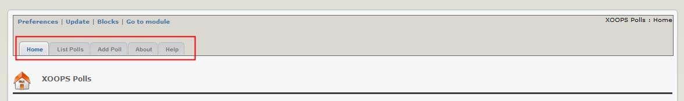
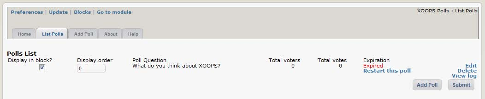
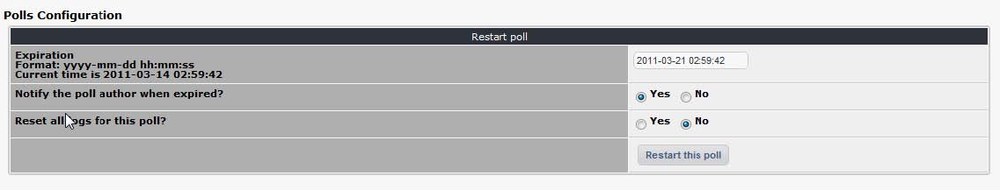
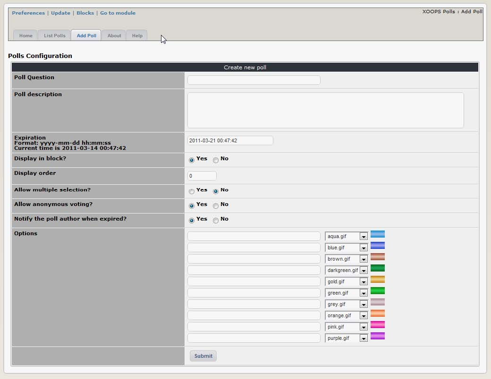
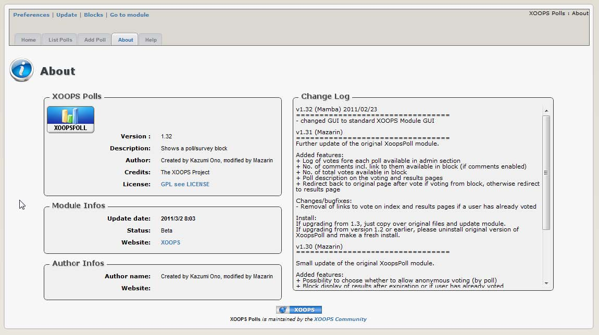

# 2.0 Administration Menu

There are four options on top:
 
   

|Option|	Action|
|---|---|
|Preferences|	Here you can configure your preferences for the module|
|Update|	Click here if you’ve made some changes to the module, uploaded new files, etc. – this will recompile the module and update all entries in the database| 
|Blocks|	When you click here, it will redirect you to the Blocks section of XOOPS, and select the blocks related to your module|
|Go to module|	If the module is visible on the user side, this will take you there|

There are four Tabs in the Administration of the Poll module: 

   
-	Home
-	List Polls
-	Add Poll
-	About 
-	Home

  

**Figure 4 View of the “List Polls” Tab**

This tab lists all existing polls, and indicates if they are active or expired. If a Poll is expired, you can restart it and set a new expiration date.

The available indicators are:

|Option|	Function|
|---|---|
|Display in block|	Show (or hide) the poll in the Polls block. You might want, for example, to hide polls once they expire.|
|Display order|	If you have multiple polls, you can set the vertical order in which they will appear in the polls block here (see ‘Blocks’ below).|
|Total voters|	How many people have voted in this poll.|
|Total votes	|Total number of votes received (people can only vote once, but if your poll is set to allow multiple choices they can vote for several items simultaneously, thus the total number of votes can exceed the number of actual voters)|
|Expiration|	The date / time on which the poll will close – no further voting will be allowed. If the poll has expired a ‘restart this poll’ link will be displayed – this allows you to reset the expiration date and notification options for the poll.|
|Edit / Delete / View log|	Select ‘edit’ to modify the poll configuration options, or ‘delete’ to remove the poll (and voting records) from the database. The ‘view log’ function doesn’t work – it was never implemented. |

When a Poll is expired, you can restart it and set a new expiration date. The options from the ‘restart polls’ link are as follows:

   

|Option|	Function|
|---|---|
|Expiration|	Set the new date for the poll to expire in the format: yyyy-mm-dd hh:mm:ss eg: 2011-12-25 08:00:00|
|Notify the poll author when expired|	If you select ‘yes’ you will receive a notification message via email or personal message, depending on the notification option you selected when you registered your account.|
|Reset all logs for this poll|	Select ‘yes’ to discard all the previous votes.|

   

***Figure 5 The “Add Poll” Tab***

The “Add Poll” Tab is for creating new Polls. 

   

***Figure 6 The “About the Module” Tab***

The “About the Module” gives you information about the module, its version number, author information, and access to changelog. 

  

***Figure 7 The “Help” Tab***

The “Help” Tab gives a short introduction to the module. Since we are offering tutorials with more detailed information, the “Help” Tab is relatively short. 

