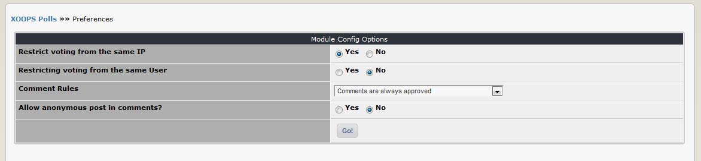

# 3.0 Preferences

In the Preferences, you can set the most important options for the module, such as the text editor 

    

**Figure 8 The Preferences options**

|Option|	Function|
|---|---|
|Restrict Voting from the same IP|	This is to ensure that people don’t vote multiply times using different user name|
|Restrict Voting from the same User|	This is to ensure that users don’t vote multiple times.|
|Comment rules|	Choose from: Comments are always approved (default) – any comment that is posted will immediately be published on the site  Comments by registered users are always approved – comments posted by anonymous visitors will not be published until approved by an Administrator  All comments need to be approved by Administrator|
|Allow anonymous post in comments?|	Do you want to allow anonymous visitors to be able to post comments on your polls? The default is ‘no’.|

