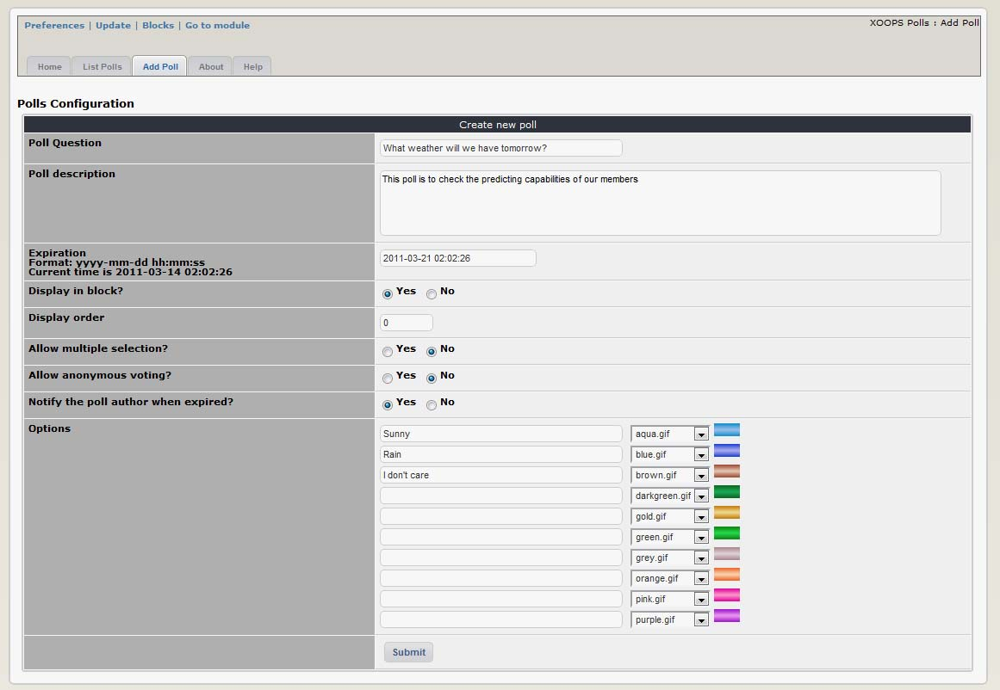
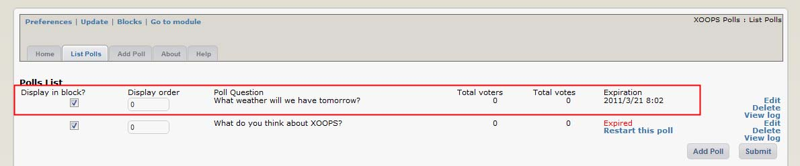
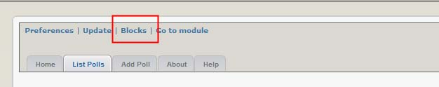
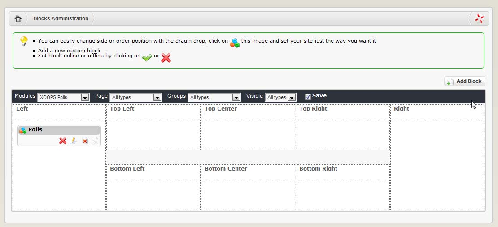
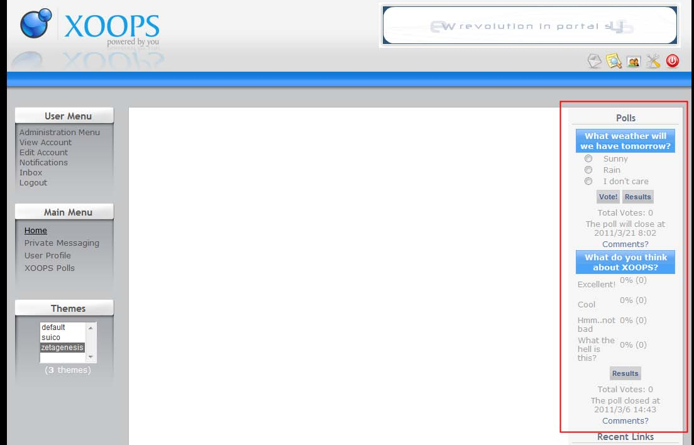

# Operating Instructions

The Polls module is very simple to configure and use. Basically you need to:

1. Create one or more polls for people to vote on \(Polls administration -&gt; Add poll\)
2. Display the Polls block somewhere on your website \(not strictly necessary – people can also access them through the ‘Polls’ link in the main menu – but displaying the polls block in a prominent location will encourage people to vote\) and
3. Ensure that relevant user groups have access rights to 

   a\) the Polls module and 

   b\) the Polls block so that they can see it and vote.

4. Most management functions for existing polls are found in Polls administration -&gt; List polls.

We covered the Preferences above.

To add a new Poll, go to the “Add Poll” Tab. This is where you create and configure new polls. The configuration options are as follows:

| Option | Function |
| --- | --- |
| Poll question | This will appear as the title of the poll – what do you want to ask ? |
| Poll description | For administrative use only – it isn’t publicly accessible anywhere. |
| Expiration | The date / time that the voting will close \(poll will still be displayed\) |
| Display in block | Select ‘yes’ for this poll to be displayed in the Polls block \(if you select ‘no’ it will still be accessible through the ‘Polls’ link in the main menu\). |
| Display order | If you have multiple polls, you can set the vertical order in which they will appear in the polls block here. Lower numbers appear at the top of the page. |
| Allow multiple selection | You can force people to select one voting option only, or allow them to select multiple options simultaneously. |
| Allow Anonymous voting | If you select ‘yes’ people won’t have to register on your Website in order to vote. This can lead sometimes to spammers voting just for fun, and thus making your survey less reliable. |
| Notify the poll author when expired ? | If you select ‘yes’ you will receive a notification via email or personal message when the poll expires according to the default notification option you selected when you registered your account. |
| Options | Enter the ‘voting choices’ here - type each permitted response in a separate box. The drop down box to the right allows you to select the colour of the bar used to display the results for this voting option in the ‘view results’ page. |

You can fill out the details for your Poll:

**Figure 9 Adding a Poll**

After we’re done, click on “Submit” and we’re done. You can check if the system has recorded your Poll by going to the “List Polls” tab:

**Figure 10 List of existing Polls**

And yes, it is saved correctly. Now it’s time to make the Poll visible to the users. This is done by using blocks \(see the section Blocks for more information\). So click on the “Blocks” link:

When you click on the top menu “Blocks” you’ll be redirected to the Blocks screen, with the Poll blocks already filtered out for you:

Poll Module provides you with only one block. First, let’s move the block to the Right position, and set the block to be visible by clicking on the “visibility” icon, which can have two states: Visible \(on-line\) invisible \(off-line\)

Now that we have it visible, let’s edit it by clicking on the “Edit” icon :

Now the “Block Edit” screen will open up:

These are the options that we need to change:

| Option | Action |
| --- | --- |
| Block Type | This to select the location where you want the block to be visible. We have already selected the Center Block – Center |
| Weight | If you have several block and want to control their order, you should set the Weight here, and the blocks will be sorted by their assigned weight. “0” is the highest, and the higher the number, the lower the position of the block5 |
| Visible | This has to be set to “Yes” if you want to make it visible |
| Visible in | Here you can select which modules you want this block to be visible in. The first two choices are the most common: either on the Top Page \(which is the page you see when you first get to the Website\), or on all pages. Or you can select individual module, or any combination of them |
| Title | You can change to  a name that is more meaningful for your users |
| Content     Edit Template | This is only if you would like to make some changes to how the block is presented |
| Cache lifetime | If the module is not frequently updated or presenting live data, it is useful to set a cache so the block won’t be generate every time opens a page  this will save some resources on your server |
| Group | Here you can select the groups that you want to see the block |

Most of the time you can leave it as it is. Once the block is set correctly and made visible, the Poll can be seen on the User side:

**Figure 11 Polls seen live on the your Website**

If you set “Display in Block” to “Yes” in the Poll options, you can now see them here. This is both for currently available for voting, as well as the expired ones, and for each poll you have a link to the results of the voting.

