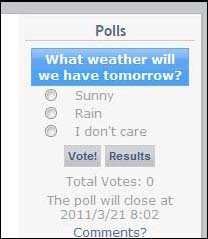
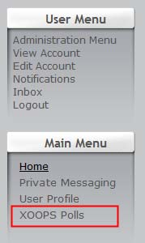
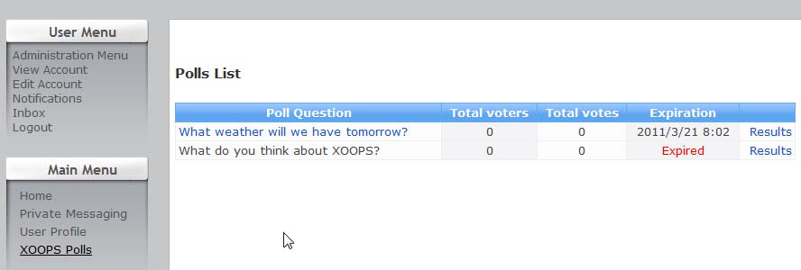
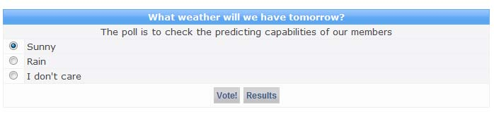
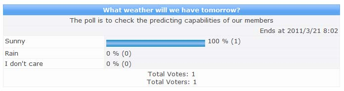

# The User Side

The Polls module is very simple from the user perspective – they can either vote, or view the results of a poll. You have two ways to access the poll and its results. One is in a block, as we’ve seen above.

The other one is using the link in the Main Menu:

Which will open the list of Polls:

The polls that are available for voting will have an active link. For the expired ones, you’ll only have a link to the results.

**Voting**

Make a choice \(or several choices if multiple selections have been enabled\) and press the ‘Vote!’ button ! It’s that simple. A ‘thank you’ message will be displayed. Once a user has voted they can’t vote again – a ‘sorry you have already voted’ message will be displayed if they try.

After voting, the user is directed to the ‘Poll results’ page.

**Viewing poll results**

Poll results are also accessible through the ‘results’ button on the polls block or from the Polls index page.

